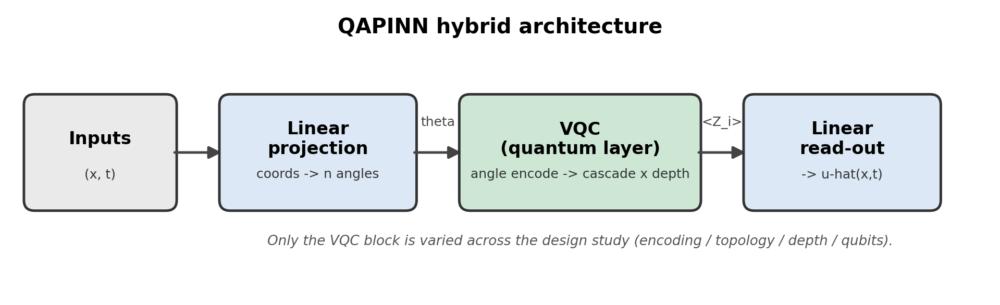
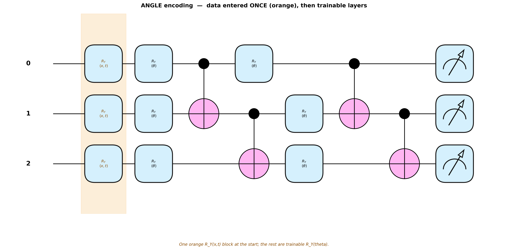
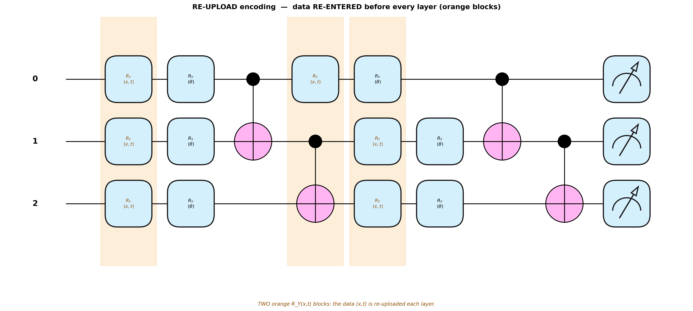
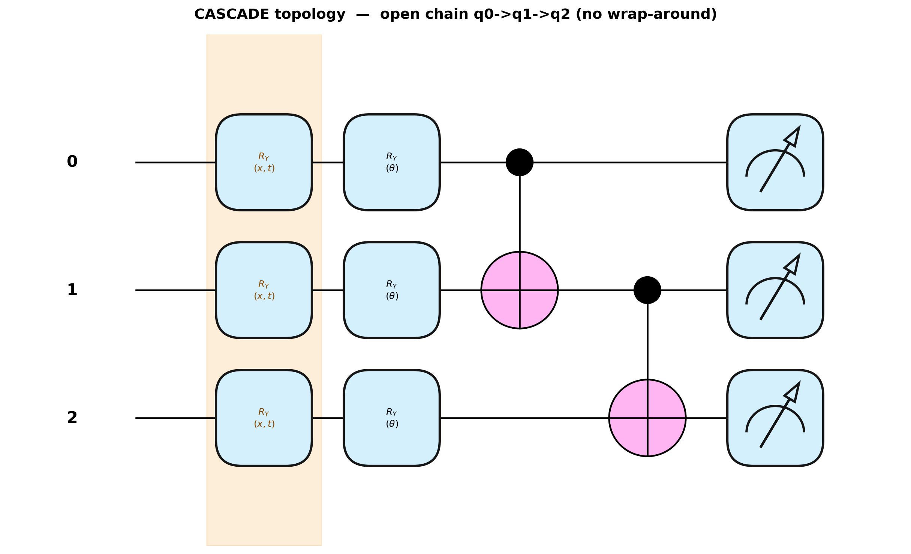
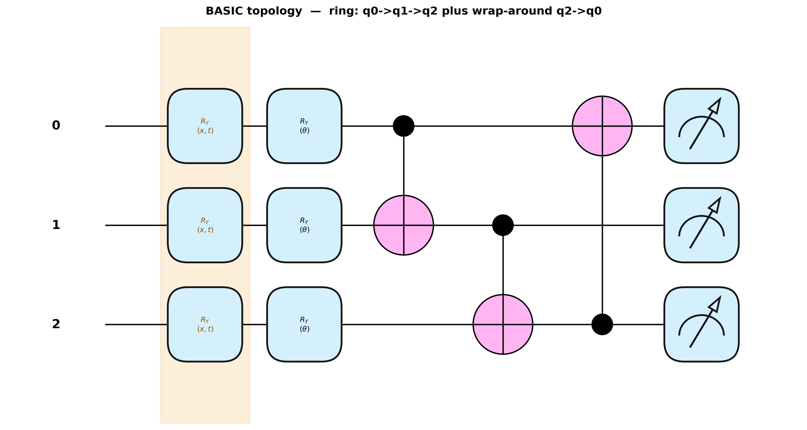
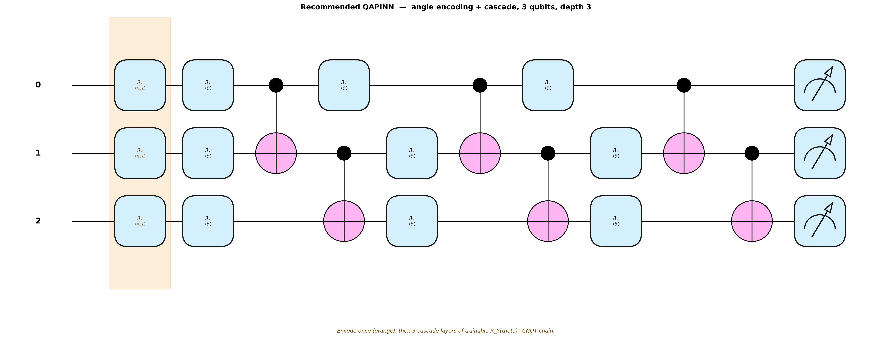

# Designing a Problem-Specific Quantum Circuit

*Develop a methodology for constructing a problem-specific quantum circuit and QAPINN architecture.*

This page explains the quantum-circuit design choices behind our Quantum-Assisted Physics-Informed Neural Network (QAPINN), with circuit diagrams. The full staged methodology, fair-comparison protocol, and results are in the PDF linked at the bottom.

**Headline finding:** across the 1D heat and Burgers equations, the best circuit is **angle encoding + a cascade (chain) entangling topology, at 3 qubits and depth 3**. On the smooth heat equation the quantum layer beats a classical PINN with fewer parameters; on the sharper Burgers equation it is a parameter-efficiency win rather than an accuracy win.

---

## The QAPINN architecture

A QAPINN keeps the skeleton of a normal PINN but swaps its middle for a small quantum circuit (a VQC). The coordinates `(x, t)` are turned into rotation angles by a classical layer, fed into the quantum circuit, and the circuit's measured outputs are mapped to the predicted field value `û(x, t)`. Everything is held fixed **except the quantum circuit**, so any change in accuracy can be attributed to the circuit design.

The circuit is defined by two main choices — **how the data is encoded** and **how the qubits are entangled** — plus two dials, **depth** and **number of qubits**.

> **Note on the diagrams:** the data-encoding gates and the trainable gates are *both* `RY` rotations. They differ only in their argument: encoding gates are `RY(x,t)` (the coordinates, shaded orange) and trainable gates are `RY(θ)` (the learned weights).

---

## 1. Encoding: how the data enters the circuit

The encoding decides how many times, and where, the coordinates `(x, t)` are injected into the circuit.

**Angle encoding** feeds the data in *once*, at the very beginning, as qubit rotation angles. After that, only the trainable layers act. It is the simplest and fastest option and is usually the easiest to train.

**Re-upload encoding** feeds the data in *again before every layer* — the coordinates are re-injected repeatedly (note the two orange `RY(x,t)` blocks below). This makes the model more expressive: a data-reuploading circuit builds a richer Fourier series, so it can represent finer, higher-frequency structure. The cost is that it is slower and can be harder to optimise, and deep re-upload circuits can suffer weak or unstable gradients.

In short: angle is the lean, stable default; re-upload buys extra expressivity at the price of training difficulty. **In our experiments, angle encoding won.**

---

## 2. Topology: how the qubits are entangled

The topology decides which qubits get linked by entangling (CNOT) gates inside each layer. This is what lets the qubits share information instead of evolving independently.

**Cascade (chain) topology** entangles the qubits sequentially in an open chain: q0→q1→q2, with **no** wrap-around. Information flows down the line of qubits one step at a time. This is the sequential-entanglement structure used in the QCPINN paper, which is why we treat it as the principled default.

**Basic (ring) topology** entangles the qubits in a loop: q0→q1, q1→q2, and then a wrap-around gate q2→q0 that closes the ring. Every qubit connects to two neighbours, including the long-range wrap-around link.

Cascade is a lighter, more orderly entangling pattern; basic adds the extra closing link. **In our experiments, cascade beat basic on both PDEs.**

---

## 3. Depth and qubits: the two dials

**Depth** is how many times the entangling layer is repeated. More depth means more expressive power, but also more parameters and a greater risk of the training signal vanishing (the "barren plateau" problem), so it cannot simply be turned up indefinitely.

**Number of qubits** is the width of the quantum feature space. Adding qubits generally lowers the error — but the simulation cost roughly **doubles with every qubit added** (heat went from about 2 → 6 → 12 minutes going from 2 → 3 → 4 qubits). More qubits are only worth it when the accuracy gain justifies the cost.

---

## 4. The recommended design

Putting it together, the confirmed best architecture is **angle encoding + cascade topology, 3 qubits, depth 3**:

Two results held consistently across both equations: **cascade beat basic**, and **angle beat re-upload**. The simpler, more trainable circuit won — re-upload's extra expressivity and basic's extra entangling link did not pay off in practice.

---

## Full methodology (PDF)

The complete write-up — the staged design procedure (screen → confirm → scale), the fair-comparison protocol against classical baselines, the five-seed results tables, and limitations — is here:

**📄 [methodology_report.pdf](methodology_report.pdf)**
